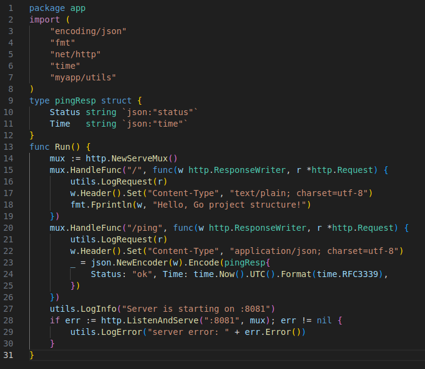
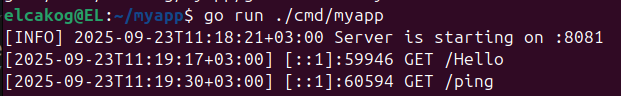
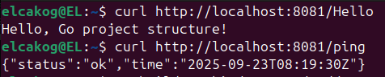
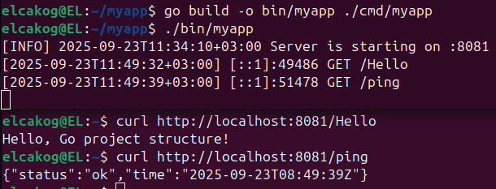
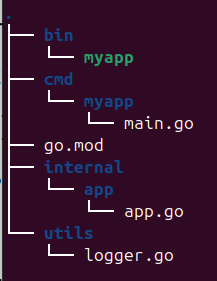

 Практическое задание 2

Студент группы *ЭФМО-02-25 Пягай Даниил Игоревич*

## Описание

**Цели:**

- Понять назначение ключевых директорий (cmd/, internal/, pkg/ и др.).
- Научиться раскладывать код и артефакты проекта по "правильным" местам.
- Собрать минимальный скелет проекта и запустить "пустой" main.go.

## Создание структуры проекта

```bash
mkdir -p ~/myapp/cmd/myapp ~/myapp/internal/app ~/myapp/utils
cd ~/myapp
```

### Инициализация модуля

```bash
go mod init myapp
```

### Создание файлов проекта

Создаём три файла:

1. cmd/myapp/main.go - минимальный вход.
2. internal/app/app.go - "сердце" приложения.
3. utils/logger.go - простой логгер.

Содержание cmd/myapp/main.go:


Содержание internal/app/app.go:



Содержание utils/logger.go:


## Запуск и проверка

```bash
go run ./cmd/myapp
```


Проверка запущенного API (в другом терминале):

```bash
curl http://localhost:8081/Hello
curl http://localhost:8081/ping
```


## Сборка бинарника

```bash
go build -o bin/myapp ./cmd/myapp
./bin/myapp
```



Ответы `curl` совпадают с предыдущим шагом.

## Структура проекта

'''bash


